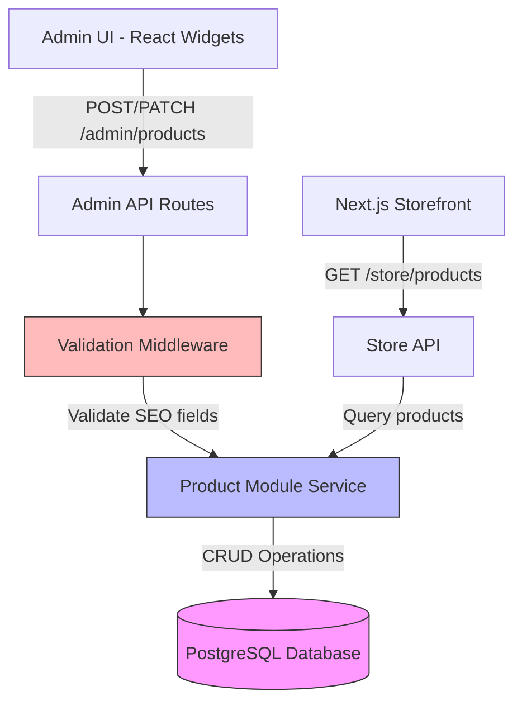

# Design Document

## Overview

This design extends the MedusaJS v2 product entity with three custom SEO fields (seo_title, seo_description, short_description) to enable better search engine optimization and product presentation. The implementation leverages MedusaJS v2's architecture with MikroORM for database operations, custom API routes for backend logic, and Admin SDK widgets for UI customization.

The solution follows MedusaJS v2 patterns:
- **Database Layer**: SQL migrations for schema changes (MikroORM/PostgreSQL)
- **Data Model Layer**: Product module extension using data models
- **API Layer**: Custom middleware and route handlers for validation
- **Admin UI Layer**: Widget-based customization using Admin SDK

## Architecture

### High-Level Component Diagram



### Data Flow

1. **Create/Update Product Flow**:
   - Admin UI sends product data including SEO fields
   - Custom middleware intercepts request
   - Validation logic checks if status="published" requires SEO fields
   - Product module service persists data to database
   - Response includes all fields including SEO metadata

2. **Retrieve Product Flow**:
   - Admin/Store API requests product data
   - Product module queries database
   - Response automatically includes SEO fields (no additional logic needed)

## Components and Interfaces

### 1. Database Migration

**Location**: `medusajs-2.0-for-railway-boilerplate/backend/src/migrations/`

**File**: `[TIMESTAMP]_add_seo_fields_to_product.ts`

MedusaJS v2 uses MikroORM which supports TypeScript migration files. The migration will:

```typescript
// Up migration
ALTER TABLE product 
  ADD COLUMN seo_title TEXT,
  ADD COLUMN seo_description TEXT,
  ADD COLUMN short_description TEXT;

// Down migration
ALTER TABLE product 
  DROP COLUMN IF EXISTS seo_title,
  DROP COLUMN IF EXISTS seo_description,
  DROP COLUMN IF EXISTS short_description;
```

**Key Design Decisions**:
- Use TEXT type (unlimited length) instead of VARCHAR for flexibility
- All columns nullable to maintain backward compatibility
- Use IF EXISTS in down migration for idempotency
- Follow MikroORM migration naming: `Migration[TIMESTAMP]`

### 2. Product Data Model Extension

**Location**: `medusajs-2.0-for-railway-boilerplate/backend/src/models/product.ts`

MedusaJS v2 allows extending core models through the data model pattern:

```typescript
import { model } from "@medusajs/utils"

const Product = model.define("product", {
  seo_title: model.text().nullable(),
  seo_description: model.text().nullable(),
  short_description: model.text().nullable(),
})

export default Product
```

**Key Design Decisions**:
- Use MedusaJS v2 model definition API
- Fields are nullable by default
- No need to redefine existing product fields
- Model automatically merges with core Product entity

### 3. Validation Middleware

**Location**: `medusajs-2.0-for-railway-boilerplate/backend/src/api/middlewares.ts`

Custom middleware to validate SEO fields before product creation/update:

```typescript
interface ValidationConfig {
  routes: Array<{
    matcher: string | RegExp
    middlewares: Array<MiddlewareFunction>
  }>
}
```

**Validation Logic**:
```typescript
function validateSeoFields(req, res, next) {
  const { status, seo_title, seo_description } = req.body
  
  if (status === "published") {
    if (!seo_title?.trim()) {
      return res.status(400).json({
        message: "seo_title is required for published products"
      })
    }
    if (!seo_description?.trim()) {
      return res.status(400).json({
        message: "seo_description is required for published products"
      })
    }
  }
  
  next()
}
```

**Applied to routes**:
- `POST /admin/products`
- `POST /admin/products/:id`

**Key Design Decisions**:
- Middleware approach keeps validation separate from core logic
- Only validates on publish (status="published")
- Checks for null, undefined, and whitespace-only strings
- Returns clear, actionable error messages
- Does not block non-published products

### 4. Admin API Route Handlers

**Location**: `medusajs-2.0-for-railway-boilerplate/backend/src/api/admin/products/route.ts`

Custom route handlers to ensure SEO fields are accepted and returned:

```typescript
export async function POST(req: MedusaRequest, res: MedusaResponse) {
  const productModuleService = req.scope.resolve("productModuleService")
  
  const { seo_title, seo_description, short_description, ...productData } = req.body
  
  const product = await productModuleService.create({
    ...productData,
    seo_title,
    seo_description,
    short_description
  })
  
  res.json({ product })
}
```

**Key Design Decisions**:
- Leverage MedusaJS v2 file-based routing
- Use dependency injection to access product module service
- Pass SEO fields directly to service (no transformation needed)
- Return complete product object including SEO fields

### 5. Admin UI Widgets

**Location**: `medusajs-2.0-for-railway-boilerplate/backend/src/admin/widgets/product-seo-fields.tsx`

React widget to add SEO fields to product create/edit forms:

```typescript
interface ProductSeoFieldsProps {
  data?: {
    seo_title?: string
    seo_description?: string
    short_description?: string
  }
}
```

**Widget Configuration**:
```typescript
export const config = defineWidgetConfig({
  zone: [
    "product.details.after",
    "product.create.after"
  ]
})
```

**UI Components**:
- Input field for Meta Title (seo_title)
- Textarea for Meta Description (seo_description) with character counter
- Textarea for Short Description (short_description)
- Grouped in a "SEO & Marketing" section

**Key Design Decisions**:
- Use Admin SDK's widget system for non-invasive UI extension
- Inject into both create and edit product zones
- Character counter for seo_description (recommended 155-160 chars)
- Form validation displays API error messages
- Fields are optional in UI (validation happens server-side)

## Data Models

### Extended Product Entity

```typescript
interface Product {
  // ... existing MedusaJS fields (id, title, description, etc.)
  
  // New SEO fields
  seo_title: string | null
  seo_description: string | null
  short_description: string | null
}
```

### API Request DTOs

**Create Product Request**:
```typescript
interface CreateProductRequest {
  title: string
  status?: "draft" | "published" | "proposed" | "rejected"
  seo_title?: string
  seo_description?: string
  short_description?: string
  // ... other product fields
}
```

**Update Product Request**:
```typescript
interface UpdateProductRequest {
  status?: "draft" | "published" | "proposed" | "rejected"
  seo_title?: string
  seo_description?: string
  short_description?: string
  // ... other product fields
}
```

### API Response DTOs

**Product Response**:
```typescript
interface ProductResponse {
  product: {
    id: string
    title: string
    status: string
    seo_title: string | null
    seo_description: string | null
    short_description: string | null
    // ... other product fields
  }
}
```

## Error Handling

### Validation Errors

**HTTP 400 - Bad Request**:
```json
{
  "message": "seo_title is required for published products",
  "type": "validation_error"
}
```

```json
{
  "message": "seo_description is required for published products",
  "type": "validation_error"
}
```

### Migration Errors

**Rollback Strategy**:
- If migration fails, use `DROP COLUMN IF EXISTS` to safely rollback
- Log migration errors for debugging
- Ensure no data loss on existing products

### API Errors

**Error Scenarios**:
1. Publishing without SEO fields → 400 with clear message
2. Database connection issues → 500 with generic message
3. Invalid product ID → 404 not found

## Testing Strategy

### Manual Testing Checklist

**Database Migration Testing**:
1. Run migration up → verify columns exist in product table
2. Check existing products → verify NULL values for new columns
3. Run migration down → verify columns removed
4. Run migration up again → verify idempotency

**API Testing**:
1. Create draft product without SEO fields → should succeed
2. Create published product without seo_title → should fail with 400
3. Create published product without seo_description → should fail with 400
4. Create published product with all SEO fields → should succeed
5. Update draft to published without SEO fields → should fail with 400
6. Update published product SEO fields → should succeed
7. Retrieve product → should include SEO fields in response

**Admin UI Testing**:
1. Open Create Product form → verify SEO fields visible
2. Fill SEO fields and create product → verify data persists
3. Open Edit Product form → verify SEO fields populated
4. Update SEO fields → verify changes saved
5. Character counter for meta description → verify updates on typing
6. Attempt to publish without SEO fields → verify error message displays

**Storefront Testing** (Future):
1. Query product from Store API → verify SEO fields included
2. Render product page → verify meta tags use seo_title/seo_description
3. Fallback behavior → verify title/subtitle used when SEO fields null

### Automated Testing (Optional)

**Unit Tests**:
- Validation middleware logic
- SEO field trimming and null checks

**Integration Tests**:
- Product creation with SEO fields
- Product update with status change
- Validation error responses

## Deployment Considerations

### Railway Deployment

**Migration Execution**:
- Migrations run automatically on deployment via `medusa migrations run`
- Ensure `DATABASE_URL` environment variable is set
- Monitor migration logs for errors

**Zero-Downtime Strategy**:
1. Deploy migration (adds nullable columns) → no breaking changes
2. Deploy API changes → backward compatible
3. Deploy Admin UI changes → progressive enhancement

**Rollback Plan**:
1. Revert Admin UI changes
2. Revert API changes
3. Run down migration to remove columns

### Environment Variables

No new environment variables required. Existing configuration sufficient:
- `DATABASE_URL` - PostgreSQL connection string
- `ADMIN_CORS` - Admin UI CORS settings
- `STORE_CORS` - Storefront CORS settings

## Future Enhancements

### Storefront Integration

**Meta Tags Implementation**:
```tsx
<Head>
  <title>{product.seo_title || product.title}</title>
  <meta 
    name="description" 
    content={product.seo_description || product.subtitle || ""} 
  />
</Head>
```

**Product Listing Cards**:
```tsx
<p className="product-short-description">
  {product.short_description || product.description?.substring(0, 100)}
</p>
```

### SEO Enhancements

- Open Graph tags (og:title, og:description)
- Twitter Card metadata
- Structured data (JSON-LD for products)
- Canonical URLs
- Image alt text optimization

### Admin UI Enhancements

- SEO score indicator (title length, description length)
- Preview of how product appears in search results
- Bulk edit SEO fields for multiple products
- SEO field templates/presets
- AI-generated SEO suggestions

## Compatibility Notes

### MedusaJS Version Compatibility

**Current Implementation**: MedusaJS v2.10.2
- Uses MikroORM for database operations
- Uses Admin SDK for UI customization
- Uses file-based routing for API routes

**If Migrating to Future Versions**:
- Migration files should remain compatible
- Data model extensions may need syntax updates
- Admin widgets may require Admin SDK updates
- Monitor MedusaJS changelog for breaking changes

### Database Compatibility

**PostgreSQL**: Primary target (Railway deployment)
**SQLite**: Compatible (development environments)
**MySQL**: Compatible with minor adjustments (TEXT type)

### Backward Compatibility

- Existing products automatically get NULL for new fields
- No breaking changes to existing API contracts
- Admin UI gracefully handles missing SEO data
- Storefront uses fallback values when SEO fields are NULL
